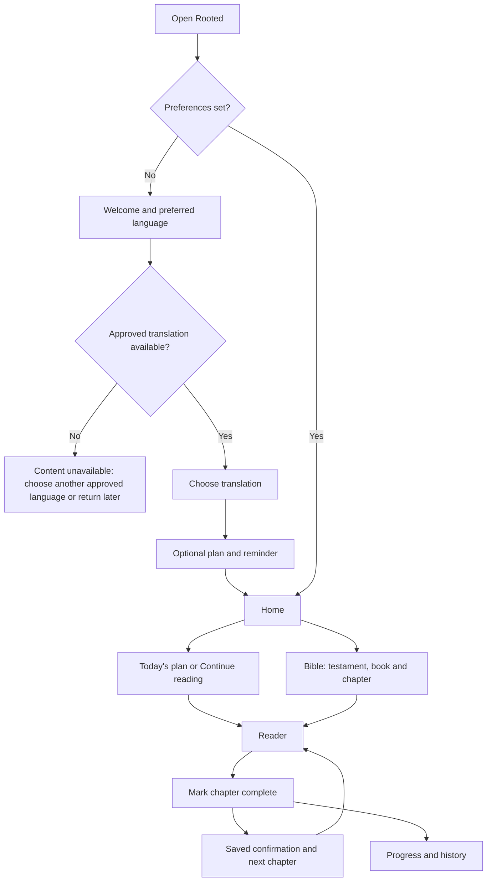

# User flow

Owner confirmed individual sign-in plus church accounts. Proposed first-session entry: Welcome → Individual account / Church account → verified sign-in → language/approved edition → optional plan → reader. This document specifies the flow; new identity integration is not yet implemented.

Individual registration must verify email through the selected identity provider. Church membership is an optional relationship with an invite/approval step; it never grants admin roles from a user-supplied field. Returning users sign in through the same verified identity system. Onboarding permits skipping plan/reminder choices. Translation selection never offers an unapproved edition as readable. A valid direct reader link opens its chapter; an unknown/withdrawn edition returns an unavailable state and a Bible link. No blank redirect loops.

Reader: header shows translation and reference; primary body is Scripture; footer has previous, completion and next. Leaving saves the verse anchor, not selected text. Completion persists before confirmation; failed storage keeps the action recoverable and never claims it saved.

Plans: catalog → details (duration, coverage, compatibility) → Start → active day → all assigned passages → day complete. Starting another plan asks whether to preserve and pause/abandon the old enrollment; no silent deletion. No passage completion when content failed to load.

Settings → reading preview → apply immediately → back returns to the same verse. Data deletion shows what is affected and requires explicit confirmation. Notification permission is requested only after enable; decline leaves reading fully usable.

Offline: bundled licensed and installed text works locally; an API-only edition explains unavailability. Do not say downloaded content is available unless it actually exists and remains permitted.
