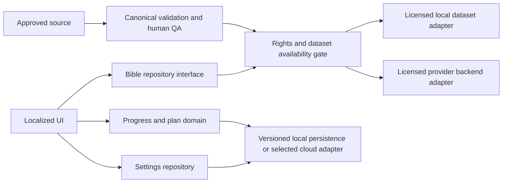

# Technical architecture

## Existing baseline

React/TypeScript/Vite PWA with Capacitor wrappers; FastAPI/SQLAlchemy/Postgres backend, member-code auth, admin routes. Local development API now uses port 8001; Docker retains its documented internal backend port. Database configuration is not production-ready.

## Proposed architecture and open choice

Keep React/TypeScript and the repository's build tooling. Owner selected individual sign-in in addition to church accounts. Use a verified identity provider and account-scoped server persistence, with optional church membership. A provider-issued subject maps to an internal account; roles and church membership are server-managed. Supabase Auth is a candidate because Supabase is already in the project, but configuration/provider selection is not yet verified. Do not implement another member-code-only login. Add verified registration, sign-in/out, confirmation, recovery, rate limits and session revocation; test cross-user access and migration before exposure. Do not remove existing data or fabricate a migration from plan-day completion to chapters.

Content access mode is edition-specific, never assumed from account mode. Local-only progress does not imply offline Scripture rights. API provider credentials stay server-side; no general provider integration before written scope. No Bible runtime cache or service-worker precache unless the specific storage/caching/bundling/distribution grants permit it. Memory caching also needs review for an API edition. Current React Query content retention needs that review before launch.

Canonical domain modules: translations/licensing, books/chapters/verses, completion/history, timezone/streak functions, plan catalog/enrollment, preferences, import validation. Repository interfaces isolate format and storage. UI cannot consume provider raw JSON or trust a query-string license flag.

Persistence proposal: server-backed account progress in Postgres, with local display preferences. IndexedDB is only for specifically permitted local content or later offline progress; offline synchronization is not silently promised. Atomic completion/history/plan writes; handle storage denial/quota and multi-tab conflicts; never show saved until committed. Cache last verse anchor on bounded events and page hide. Server implementation uses transactions, account scoping and idempotency keys. Existing church plan data stays separate from canonical chapter history until an explicit migration exists.

Migration: read schema version → backup/export where applicable → transactional migration → verify record counts and stable references → promote. Failure retains old records and a recovery path. Legacy plan days remain legacy plan days. Dataset upgrades require explicit versification mapping, never a text/name heuristic.

Performance proposal: lazy route modules, chapter-granularity fetching, no full-Bible React tree, indexed translation/book/chapter keys. Measure cold launch and chapter latency before adding complexity.

Notifications: capability adapter (`supported`, `permission`, `schedule`, `cancel`). Native local notification integration requires platform selection and tests. A web timer cannot promise reminders after the browser closes; UI must state actual support. No fake enabled toggle.

Release infrastructure: project-scoped repository first (current directory inherits a parent Git repository); no blanket `git add` of parent files. CI checks build, domain tests, synthetic content validation, dependency/secret scans and license gate. Signing/deployment remain manual owner-controlled gates until environments exist.
